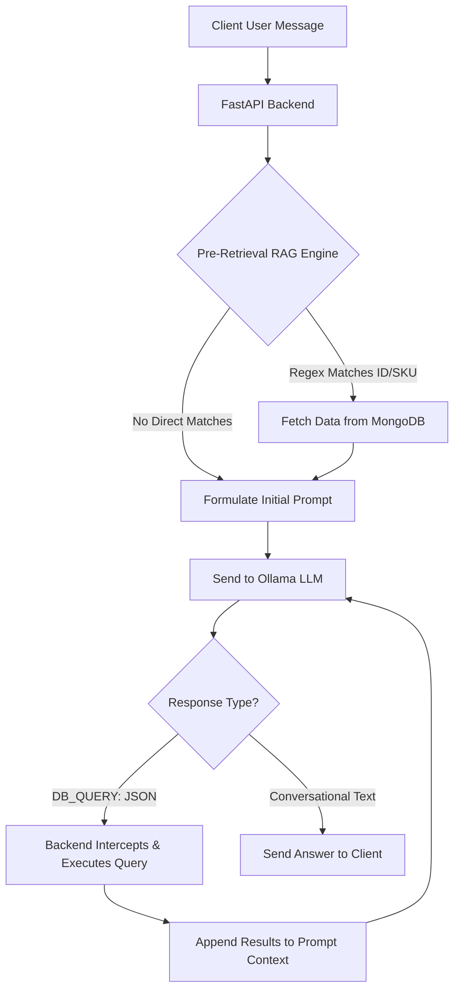

# How to Enable Ollama to Query a MongoDB Database

This guide explains how we implemented the **ReAct (Reasoning and Acting)** agent pattern on the backend to allow local Ollama LLM models to dynamically query MongoDB. 

You can use this architecture to connect **any** local LLM (e.g., Llama 3, Mistral, Qwen) to any database (SQL or NoSQL) without needing specialized model-side API support.

---

## The Core Challenge
Local models run inside Ollama do not natively support function calling (MCP tools) out of the box like proprietary APIs (OpenAI or Anthropic) do. 
To bypass this limitation, we use **Prompt Engineering (ReAct format)** combined with an **Execution Loop** in our FastAPI backend.

---

## System Architecture



---

## Step 1: Prompt Engineering (The ReAct System Prompt)
We instruct the LLM on the database schema and give it a strict syntax for requesting data. We tell the model to output a special string, `DB_QUERY: <JSON_COMMAND>`, when it needs information, and to stop generating immediately.

Here is the system prompt configured in [chatbot.py](file:///c:/Users/Sabor/Desktop/project/BackEnd/app/routers/chatbot.py):

```python
system_prompt = (
    "You are 'Executive AI Assistant', a supply chain database querying agent.\n"
    "You have direct connection tools to query MongoDB to answer user questions.\n\n"
    
    "DATABASE SCHEMA & COLLECTIONS:\n"
    "1. **sales_orders**: Fields: 'id' (int), 'client_id' (str), 'order_date' (str), 'status' (str), 'order_profit' (float), 'scheduled_shipment' (int), 'real_shipment' (int), 'order_lines' (list of {'quantity': int, 'unitPrice': float, 'product_sku': int})\n"
    "2. **anomalies**: Fields: 'anomaly' (str), 'score' (float), 'type' (str), 'timestamp' (str), 'description' (str), 'sales_order_id' (int)\n"
    "3. **products**: Fields: 'sku' (int), 'name' (str), 'price' (float), 'discount' (float), 'category' (str), 'current_stock' (int)\n"
    "4. **client**: Fields: 'id' (str), 'first_name' (str), 'last_name' (str), 'email' (str), 'country' (str), 'rfm_score' (float)\n"
    "5. **kpis**: Fields: 'name' (str), 'value' (float)\n\n"
    
    "HOW TO QUERY THE DATABASE (MCP TOOL CALLING):\n"
    "If you do not have the database answers in the pre-retrieved data, you MUST write a tool call in the following format on a single line:\n"
    "DB_QUERY: {\"collection\": \"<collection_name>\", \"operation\": \"find_one\"|\"find_many\"|\"count\", \"filter\": <filter_dict>}\n"
    "Do not write any other text when writing a DB_QUERY. Output ONLY the DB_QUERY line and stop.\n\n"
    
    "Example:\n"
    "User asks: 'anomalies for order 367'\n"
    "You write: DB_QUERY: {\"collection\": \"anomalies\", \"operation\": \"find_many\", \"filter\": {\"sales_order_id\": 367}}\n\n"
    
    "FINAL ANSWER INSTRUCTIONS:\n"
    "Once you have the database results (either pre-retrieved or after executing DB_QUERY), write a clean, conversational response to the user. "
    "Do not display the DB_QUERY commands to the user. Keep final responses to 3 sentences max. "
    "If the response references a specific sales order ID (e.g. PO 367), you MUST output a markdown link formatted exactly as: [PO #<id>](http://localhost:4200/sales-order?orderId=<id>) so the user can easily open it directly from the chat window."
)
```

---

## Step 2: The Backend Execution Loop
When the FastAPI backend receives the LLM's response, it checks if the response contains the substring `"DB_QUERY:"`.

* **If it does not contain `DB_QUERY:`**: The response is conversational. The backend returns it to the client.
* **If it contains `DB_QUERY:`**: The backend:
  1. Extracts the JSON string after `DB_QUERY: `.
  2. Parses the JSON.
  3. Executes the operation (e.g., `db[collection].find(filter)`) against the live MongoDB instance.
  4. Serializes the database documents into a text representation.
  5. Appends the database results back to the prompt history as a `system` instruction: `[Database Output]: <JSON_RESULTS>`.
  6. Re-queries Ollama with this updated history.

Here is the simplified python implementation of this loop:

```python
# Limit the hops to prevent infinite loops (max 3 database calls per question)
max_hops = 3
current_hop = 0

while current_hop < max_hops:
    # 1. Send the prompt (which has the system prompt + history + any DB results) to Ollama
    response = await call_ollama(prompt)
    llm_text = response.get("response", "").strip()

    # 2. Check if the model is requesting a database query
    if "DB_QUERY:" in llm_text:
        current_hop += 1
        
        # 3. Parse query
        query_json = extract_json_from_db_query_line(llm_text)
        
        # 4. Run the query on MongoDB
        db_results = await execute_mongo_query(query_json)
        
        # 5. Append findings to context history
        prompt += f"\n\n[Database Output]: {db_results}"
    else:
        # Conversational answer received! Exit loop and return to client
        return {"response": llm_text}
```

---

## Step 3: Optimization — Pre-Retrieval (Zero-Shot RAG)
Because LLM roundtrips to Ollama can take a few seconds on CPU or consumer GPUs, we implemented **Pre-Retrieval** to minimize latency. 

Before even invoking Ollama the first time, the backend uses fast Regex pattern matching to scan the user's message for common keywords:
* **Order ID Patterns**: Matches words like `po 367`, `order 8410`, etc.
* **SKU/Product Patterns**: Matches `sku 105`, `product 402`, etc.
* **KPI Keywords**: Matches metrics like `revenue`, `profit`, `anomalies`.

If a regex pattern hits, the backend queries MongoDB immediately and injects those records into the initial prompt context under a `PRE-RETRIEVED CONTEXT` header:

```python
# Context injected dynamically before first LLM call:
pre_context = {}
order_match = re.search(r'\b(?:po|order)\s*#?(\d+)\b', message_lower)
if order_match:
    order_id = int(order_match.group(1))
    order_data = await db["sales_orders"].find_one({"id": order_id})
    pre_context["sales_orders"] = order_data
```

Because of this, if a user asks: *"Tell me about order 367"*, the backend pulls the order details in **0.01 seconds** and feeds it into the first prompt. Ollama has the answer immediately, skipping the secondary roundtrip entirely!

---

## Key Benefits of this Implementation
1. **Model Agnostic**: Works with small local models (like `llama3:8b`, `phi3`, or `gemma2`) because the structured tool command instructions are easy to follow.
2. **Zero Dependencies**: Does not require complex agent libraries (like LangChain or AutoGen), keeping the codebase fast, readable, and easy to debug.
3. **Secure**: The backend acts as a gateway proxy. The LLM cannot run arbitrary python code or delete database collections because the backend only executes a hardcoded set of query verbs (`find_one`, `find_many`, `count`).
